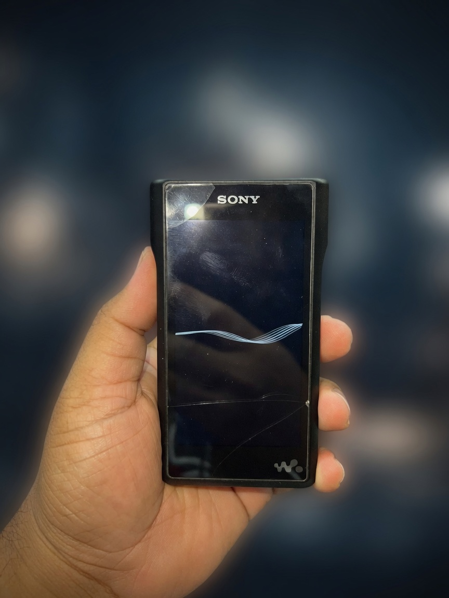
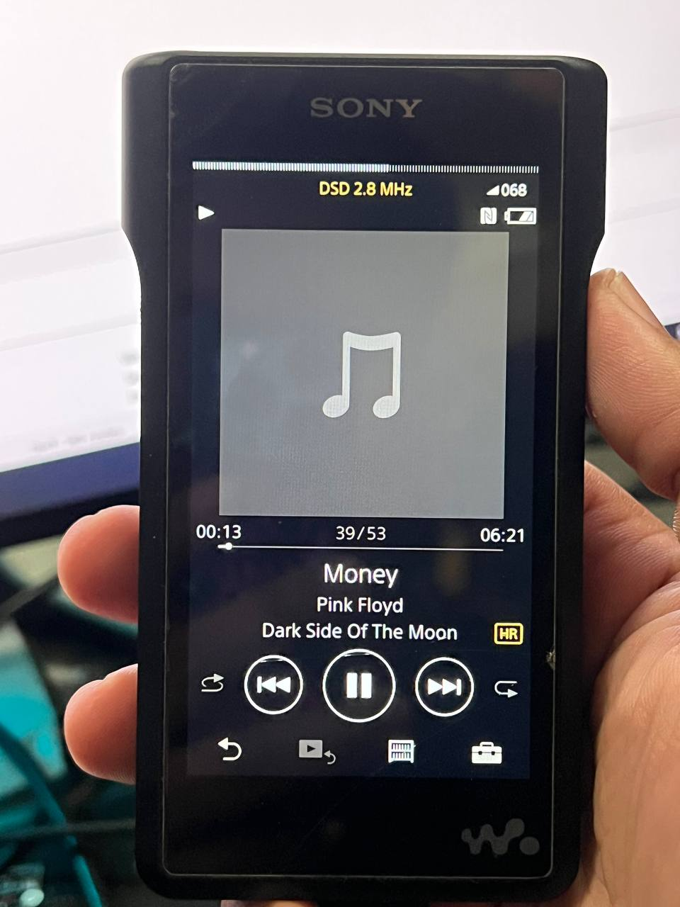

# WM1 Recovery

A Walkman went into a car and came back looping the Sony logo like it had seen something it could not unsee.

I took it to a Sony service centre. They said replace the board. That did not sit right. The thing still enumerated over USB. It was not a brick. It was a machine having a filesystem argument with itself.

Windows still listed it as a WALKMAN. The music drive lasted about five seconds, then vanished. Official advice is to format from the player. The player would not boot far enough to format itself. That is a closed loop, and a new board is an expensive way to lose the argument. This project exists because I did not believe the motherboard was the problem. I used whatever embedded knowledge I had, talked to the Preloader like a stubborn SoC, and pulled it back.



*The logo loop. Sony wanted a new board for this.*

What actually happened: the music partition had been overwritten with a random PC-style MBR. USB still answered vendor queries. The flash was not dead. The firmware just refused to mount garbage and then panicked in a circle. The working fix is ugly and specific. Talk to the MediaTek Preloader, flash a temporary boot that is allowed to run Sony's own `format_contents`, then get off that boot image. If you were on Walkman One and want factory firmware, run StockRevert and the last official Sony 3.02 package after that. None of that belongs on a random `PhysicalDrive` number.

It came back. Same player. Pink Floyd, even.



*After. No new board.*

This is a Windows app for NW-WM1A / NW-WM1Z. Thai UI, big buttons, one job at a time. It will not format your laptop.

## Run

Need Python:

```bat
Start-WM1-Recovery.cmd
```

Do not want Python. Pack a portable folder (needs the local `vendor/mtk` tools on the build machine):

```bat
pack.cmd
```

Copy `dist\WM1Recovery\` anywhere, or unzip `dist\WM1Recovery-portable.zip`. Double-click `WM1Recovery.exe` inside. Logs and work files stay in that folder. Run it as Administrator. The WinUSB driver still installs into Windows; the app itself does not.

## Buttons

- **ตรวจเครื่อง** — stock vs Walkman One vs Preloader vs "USB works, no music"
- **ติดตั้งไดรเวอร์ Preloader** — WinUSB for `VID 0E8D / PID 2000` so another PC can see Preloader
- **ลบไฟล์ Walkman One** — deletes `CFW\` and `wm1a-repair.log` on the Walkman volume only
- **กู้พาร์ติชันเพลง** — backup this unit's boot, flash a guarded repair boot, let Sony format the music partition, read it back
- **กลับเฟิร์มสต็อก** — launches *your* StockRevert + Sony 3.02 EXEs if you have them
- **คืน boot เดิม** — after a repair boot, put the original boot back

Preloader, USB already connected: hold Volume Down + Play, hold Power 8–10 seconds, keep the first two buttons down about ten seconds after Power.

## What is not in this repo

Dumps from a real player. `DA.bin`. `flash_tool.exe`. Walkman One. Sony firmware. If you put those on GitHub you are publishing someone else's Walkman and someone else's installer. The app downloads the Preloader flash tool when missing, or reuses `vendor/mtk` / `tools/mtk` on the build PC. StockRevert still has to come from you.

## Tests

```bat
python -m unittest discover -v tests
```

## License

MIT for the Python here. MediaTek flash tool, wbrt, libwdi, Walkman One, and Sony firmware keep their own licenses. If this bricks a player that was already looping a logo, well. It was looping a logo. The service centre still wants to sell you a board.
